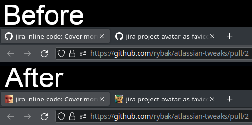

# GitHub: PR author avatar as tab icon

This user script GitHub tab icons (favicon) of pull request pages to author's
avatar.  Note that the user script sometimes overrides the dynamic display of
build status in the tab icon.

The source code is distributed under the terms of the MIT Licence.  See
[LICENSE.txt](LICENSE.txt) for details.

## How to install

1. To install this userscript in your browser you'll need a browser extension
   for managing userscripts:

   - I recommend [https://www.tampermonkey.net/](https://www.tampermonkey.net/).
   - More options are listed on <https://greasyfork.org/> (section "Step 1:
     install a userscript manager")

2. Once you have a browser extension for userscripts installed, just click on
   the link and the extension will automagically detect it as a userscript:

   <https://github.com/rybak/github-pr-avatars-tab-icons/raw/main/github-pull-request-avatars.user.js>

You can also install the script from [Greasy Fork][greasyfork].

[][greasyfork]

[greasyfork]: https://greasyfork.org/en/scripts/470905-github-pr-author-avatar-as-tab-icon "Install via Greasy Fork"
